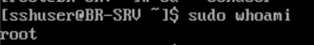
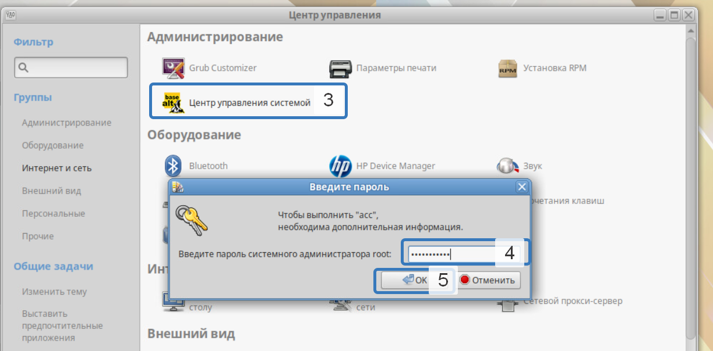
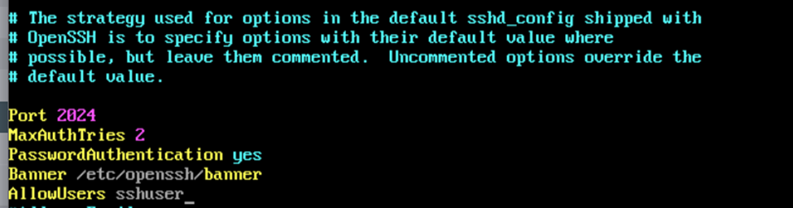

# demo2025
## Модуль 1
### Распределение IP:
| Имя устройства |  IP адресс     | Шлюз         |
| -------------- | ----------     |  ----------- |
|HQ-RTR          |172.16.4.2/28   |172.16.4.1    |
|BR-RTR		       |172.16.5.2/28   |172.16.5.1    |
|HQ-SRV          |192.168.100.2/27|192.168.100.1 |
|HQ-CLI          |DHCP/27         |192.168.200.1 |
|BR-SRV          |192.168.2.2/28  |192.168.2.1   |
### Выдача имени устройству:
```
В ISP пишем- hostnamectl set-hostname ISP; exec bash
В HQ-RTR пишем- hostname HQ-RTR.au-team.irpo
В BR-RTR пишем- hostname BR-RTR.au-team.irpo
В HQ-SRV пишем- hostnamectl set-hostname HQ-SRV.au-team.irpo; exec bash
В BR-SRV пишем- hostnamectl set-hostname BR-SRV.au-team.irpo; exec bash
В HQ-CLI пишем- hostnamectl set-hostname HQ-CLI.au-team.irpo; exec bash 
```
### 1 Назначение IP:
#### ISP
Просмотр и создание директорий для интерфейсов
```
ip -c a
mkdir /etc/net/ifaces/ens34
mkdir /etc/net/ifaces/ens35
```
Создание настроек для интерфейсов
```
vim /etc/net/ifaces/ens34/options
TYPE=eth
DISABLED=no
NM_CONTROLLED=no
BOOTPROTO=static
CONFIG_IPv4=yes
выйти и сохранить изменения в vim :wq
cp /etc/net/ifaces/ens34/options /etc/net/ifaces/ens**
```
Выдача IP
```
echo 172.16.4.1/28 > /etc/net/ifaces/ens34/ipv4address
echo 172.16.5.1/28 > /etc/net/ifaces/ens35/ipv4address
```
включение forwarding, в строке net.ipv4.ip_forward поменять 0 на 1
```
vim /etc/net/sysctl.conf
```
Перезагрузка службы network
```
systemctl restart network
```
### 2 Настройка NAT

Установка firewalld:
```
apt-get update && apt-get -y install firewalld && systemctl enable --now firewalld
```
Правила к исходящим пакетам (в сторону провайдера):
```
firewall-cmd --permanent --zone=public --add-interface=ens33
```
Правила к входящим пакетам (к локальной сети):
```
firewall-cmd --permanent --zone=trusted --add-interface=ens34
firewall-cmd --permanent --zone=trusted --add-interface=ens35
```
Включение NAT:
```
firewall-cmd --permanent --zone=public --add-masquerade
```
Сохранение правил:
```
firewall-cmd --complete-reload
```
включим forward
```
vim /etc/net/sysctl.conf
net.ipv4.ip_forward = 1
```
#### Задание 3. Создание локальных учетных записей HQ-SRV, BR-SRV

#### HQ-SRV
```
hostnamectl set-hostname HQ-SRV.au-team.irpo; exec bash
useradd -m -u 1010 sshuser
passwd sshuser
Пароль: P@ssw0rd
```
Заходим в visudo и ищем root ALL=(ALL:ALL) ALL и удаляем решотку
```
visudo
```


И сохраняем через :wq!

Далее идет команды внутри sshuser
```
vim /etc/sudoers.d/sshuser
sshuser ALL=(ALL) NOPASSWD:ALL
сохраняем и выходим через :wq!

usermode -a -G wheel sshuser
```
Проверка
```
su - sshuser
sudo whoami
```


ПОВТОРЯЕМ ТОЖЕ САМОЕ В BR-SRV!!

#### Создание пользователей в HQ-RTR и BR-RTR
#### HQ-RTR
```
enable
conf t
hostname HQ-RTR.au-team.irpo
username net_admin
password P@ssw0rd
role admin
do wr
```
#### BR-RTR
```
enable
conf t
hostname BR-RTR.au-team.irpo
username net_admin
password P@ssw0rd
role admin
do wr
```
#### Задание 4 Настройка HQ-RTR в сторону офиса

Создание интерфейса и назначение ему IP
```
int isp
ip address 172.16.4.14/28
ex
```
Создание интерфейсов для VLAN
```
interface HQ-SRV
 ip address 192.168.100.1/27
!
interface HQ-CLI
 ip address 192.168.200.1/27
!
interface HQ-MGMT
 ip address 192.168.220.1/29
!
```
Создание для каждого VLAN своего service-instance
```
port te0
 service-instance te0/isp
  encapsulation untagged
  connect ip interface isp
ex
ex
port te1
 service-instance te1/vlan100
  encapsulation dot1q 100
  rewrite pop 1
  connect ip interface HQ-SRV
ex
 service-instance te1/vlan200
  encapsulation dot1q 200
  rewrite pop 1
  connect ip interface HQ-CLI
ex
service-instance te1/vlan999
  encapsulation dot1q 999
  rewrite pop 1
  connect ip interface HQ-MGMT
ex
ex
ip route 0.0.0.0/0 172.16.4.1
ip name-server (который в ISP)
do wr
```
Для незнающих где найти name-server
```
### ISP ###
vim /etc/resolv.conf
```
Создание nat
```
ip nat pool INTERNET 192.168.100.1-192.168.100.30,192.168.200.1-192.168.200.30
ip nat source dynamic inside-to-outside pool INTERNET overload 172.16.4.14
int isp
ip nat outside
ex
int HQ-SRV
ip nat instide
ex
int HQ-CLI
ip nat instide
ex
int HQ-MGMT
ip nat instide
ex
```
Создание GRE тоннеля
```
interface tunnel.1
 ip mtu 1400
 ip address 172.16.0.1/30
 ip tunnel 172.16.4.14 172.16.5.14 mode gre
ex
```
ospf
HQ-RTR
```
en
conf t
router ospf 1
ospf router-id 172.16.0.1
network 172.16.0.0/30 area 0
network 192.168.100.0/27 area 0
network 192.168.200.0/27 area 0
network 192.168.224.0/29 area 0
passive-interface default
no passive-interface tunnel.1
exit
interface tunnel.1
ip ospf authentication message-digest
ip ospf message-digest-key 1 md5 P@ssw0rd
ex
write memory
```
dhcp
HQ-RTR
```
ip pool hq 192.168.200.2-192.168.200.2
!
dhcp-server 1
 pool hq 1
  dns 192.168.100.2
  domain-name au-team.irpo
  gateway 192.168.200.1
  mask 255.255.255.224 или так mask 27
ex
ex
int HQ-CLI
dhcp-server 1
do wr
```

#### Включение DHCP в HQ-CLI





#### HQ-SRV
Просмотр интерфейсов
```
ip -c a
```
Создание настроек интерфейсов
```
vim /etc/net/ifaces/ens33/options
возможность делать изменения в vim клавиша I
TYPE=eth
DISABLED=no
NM_CONTROLLED=no
BOOTPROTO=static
CONFIG_IPv4=yes
выйти и сохранить изменения в vim :wq
```
Выдача DNS
```
vim /etc/resolv.conf
возможность делать изменения в vim клавиша I
nameserver "DNS от ISP который в /etc/resolv.conf"
выйти и сохранить изменения в vim :wq
```
Выдача IP
```
echo 192.168.1.2/27 > /etc/net/ifaces/ens33/ipv4address
```
Выдача шлюза
```
echo default via 192.168.1.1 > /etc/net/ifaces/ens33/ipv4route
```
включение forwarding, в строке net.ipv4.ip_forward поменять 0 на 1
```
vim /etc/net/sysctl.conf
```
Перезагрузка службы network
```
systemctl restart network
```
#### Задание 5. Настройка SSH на HQ-SRV и BR-SRV
#### HQ-SRV
```
vim /etc/openssh/sshd_config
```
Пишем все как в картинке



Настройка баннера
```
vim /etc/openssh/banner
Пишем
Authorized access only
```

#### ЗАДАНИЕ 6 Настройка BR-RTR
Выбор заводской прошивки на роутере, чтоб работали порты

Создание интерфейса и назначение ему IP
```
int isp
ip address 172.16.5.14/28
ex
int lan
ip address 192.168.2.1/28
ex
```
Привязка созданных интерфейсов к портам
```
port te0
service-instance te0/isp
encapsulation untagged
connect ip interface isp
ex
ex
port te1
service-instance te1/lan
encapsulation untagged
connect ip interface lan
ex
ex
ip route 0.0.0.0/0 172.16.5.1
ip nameserver

```
Создание nat
```
ip nat pool INTERNET 192.168.2.1-192.168.2.30
ip nat source dynamic inside-to-outside pool INTERNET overload 172.16.50.14
int isp
ip nat outside
ex
int lan
ip nat instide
ex
```
Создание GRE тоннеля
```
interface tunnel.1
 ip mtu 1400
 ip address 172.16.2.2/30
 ip tunnel 172.16.5.14 172.16.4.14 mode gre
 ```
 BR-RTR OSPF
```
en
conf t
router ospf 1
ospf router-id 172.16.0.2
network 172.16.0.0/30 area 0
network 192.168.2.0/28 area 0
passive-interface default
no passive-interface tunnel.1
exit
interface tunnel.1
ip ospf authentication message-digest
ip ospf message-digest-key 1 md5 P@ssw0rd
ex
write memory
```
Маршрут в сторону ISP
```
ip route 0.0.0.0/0 172.16.5.1
do wr
```
#### BR-SRV
Просмотр интерфейсов
```
ip -c a
```
Создание настроек интерфейсов
```
vim /etc/net/ifaces/ens33/options
возможность делать изменения в vim клавиша I
TYPE=eth
DISABLED=no
NM_CONTROLLED=no
BOOTPROTO=static
CONFIG_IPv4=yes
выйти и сохранить изменения в vim :wq
```
Выдача DNS
```
vim /etc/resolv.conf
возможность делать изменения в vim клавиша I
nameserver "DNS от ISP который в /etc/resolv.conf"
выйти и сохранить изменения в vim :wq
```
Выдача IP
```
echo 192.168.2.2/28 > /etc/net/ifaces/ens33/ipv4address
```
Выдача шлюза
```
echo default via 192.168.2.1 > /etc/net/ifaces/ens33/ipv4route
```
включение forwarding, в строке net.ipv4.ip_forward поменять 0 на 1
```
vim /etc/net/sysctl.conf
```
Перезагрузка службы network
```
systemctl restart network
```
Проверка, должен пинговаться DNS от ISP:
```
do ping 'DNS от ISP'

Для одаренных

###ISP###
vim /etc/resolv.conf

Прекратить пинговать сочетание клавиш Ctrl+C
```

#### Продолжение ищите <a href = "https://github.com/Elias888s/guutfg"> тут </a>
